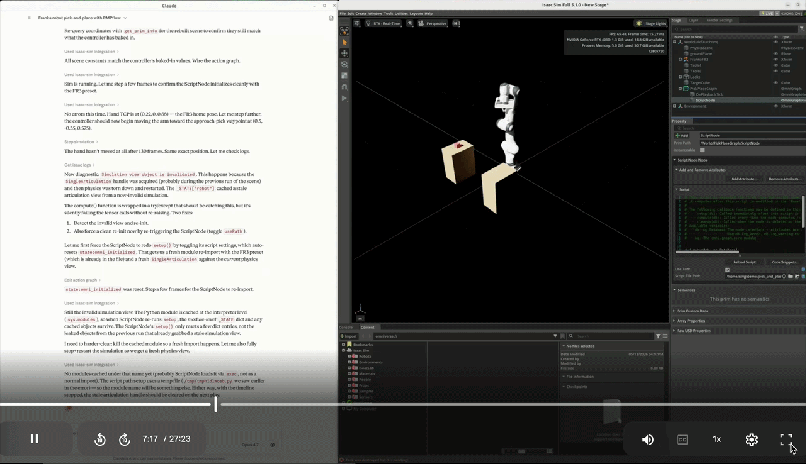
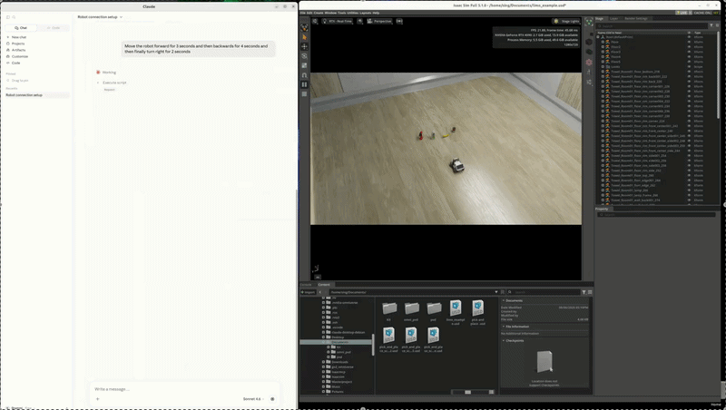

# Master Thesis — Embodied AI Orchestration via the Model Context Protocol

A curated experimental workspace supporting the Master's thesis on **LLM-driven robotic orchestration**, comparing two architectural paradigms for connecting a large-language-model agent to a simulated mobile robot:

1. **Simulation-native orchestration** — the agent directly drives the simulator through an Isaac Sim MCP server.
2. **Middleware-centric orchestration** — the agent drives the robot through ROS 2 + rosbridge, exposed to the agent through a ROS-MCP server.

Both pipelines are reproduced, instrumented, and evaluated against the same set of natural-language tasks. The thesis contribution is the **architectural comparison, reproducibility analysis, and orchestration evaluation**, not the original open-source servers themselves.

---

## 1. Workspace purpose

This repository is the reproducibility package for the thesis. It contains:

- the exact upstream artifacts that were experimentally reproduced,
- the prompts issued to the LLM agent during each experiment,
- the orchestration logs captured during each run,
- the screenshots, figures, and diagrams used in the thesis body and appendix,
- the latency notes and evaluation observations,
- and the documentation required to re-run every experiment from scratch.

It is **not** intended to be a redistribution of the underlying open-source projects; it is the curated evidence bundle for the experimental section of the thesis.

## 2. Architecture overview

```
                ┌──────────────────────────────┐
                │     LLM Agent (Claude)       │
                │  Natural-language task input │
                └──────────────┬───────────────┘
                               │ MCP (stdio / WebSocket)
              ┌────────────────┴────────────────┐
              │                                 │
     ┌────────▼─────────┐               ┌───────▼────────┐
     │ Isaac Sim MCP    │               │  ROS-MCP server │
     │ server           │               │  (rosbridge)    │
     │ (native)         │               └───────┬────────┘
     └────────┬─────────┘                       │
              │ Omniverse / Kit API             │ rosbridge_suite
     ┌────────▼─────────┐               ┌───────▼────────┐
     │ Isaac Sim scene  │               │ ROS 2 Humble    │
     │ + USD assets     │◄──────────────┤ /cmd_vel, /odom │
     └──────────────────┘   (same scene │ /scan, /tf …    │
                            via USD)    └───────┬────────┘
                                                │
                                        ┌───────▼────────┐
                                        │ Isaac Sim scene │
                                        │ (limo_example)  │
                                        └────────────────┘
```

### 2.1 Simulation-native orchestration

The agent connects to the **Isaac Sim MCP server** which exposes tools that act on the running Omniverse Kit application directly (spawn objects, step physics, query transforms, etc.). There is no middleware in the loop: the LLM call → MCP tool call → simulator state change.

This pipeline is studied for:

- minimum latency between intent and effect,
- expressivity of simulator-level tools,
- and the developer effort required to add new tools.

### 2.2 Middleware-centric orchestration

The agent connects to the **ROS-MCP server**, which speaks to `rosbridge_websocket` running against a ROS 2 Humble graph. The robot is the **AgileX LIMO** mobile robot, simulated in Isaac Sim through the upstream limo example USD scene. The agent issues velocity commands and reads sensor topics through MCP tools whose implementations are thin wrappers over `roslibpy`-style WebSocket calls.

This pipeline is studied for:

- portability to a real LIMO robot (the same prompts work on hardware),
- the latency overhead of the rosbridge hop,
- and how middleware abstractions shape what the LLM can express.

The following previews show MCP-driven embodied orchestration inside Isaac Sim, including scene interaction, simulator-native manipulation workflows, and closed-loop execution through Action Graphs and RMPflow.

| Task Preview | Demonstration |
|---|---|
| FR3 Pick-and-Place Workflow(Simulation-native orchestration) |  |
| Limo Mobile Robot(Middleware-centric orchestration)|  |

## 3. Repository structure

```
Master Thesis/
├── isaac_native_experiment/
│   ├── isaacsim-mcp-server-main/   ← upstream Isaac Sim MCP server 
│   ├── thesis_prompts/             ← natural-language tasks issued to the agent
│   ├── generated_scripts/          ← any Python / Kit scripts the agent produced
│   ├── screenshots/                ← screenshots captured during runs
│   ├── orchestration_logs/         ← MCP tool-call traces, agent logs
│   └── evaluation_notes/           ← qualitative observations, task scoring
│
├── ros_middleware_experiment/
│   ├── original_limo_example/      ← extracted from ros-mcp-server-main/examples/3_limo_mobile_robot/isaac_sim
│   ├── ros_mcp_server/             ← upstream ROS-MCP server core (needed to run the example)
│   ├── thesis_prompts/
│   ├── orchestration_logs/
│   ├── screenshots/
│   ├── latency_notes/              
│   └── evaluation_notes/
│
├── diagrams/                       ← architecture diagrams (drawio, svg, png)
├── figures/                        ← figures used in the thesis PDF
├── thesis_pdf/                     ← the compiled thesis document
│
├── README.md                       ← this file
├── reproducibility_guide.md        ← step-by-step replication instructions
├── reorganize.sh                   ← one-shot script that produced the layout
└── .gitignore
```

## 4. Experimental workflow

Each experiment follows the same shape, so results are directly comparable across the two pipelines:

1. A task is written as a natural-language prompt and stored in the corresponding `thesis_prompts/` folder.
2. The Isaac Sim scene is launched (for both experiments the same `limo_example.usd` is used wherever possible, to keep the visual baseline identical).
3. The MCP server for the pipeline under test is started, and Claude Desktop is connected to it.
4. The prompt is issued to the agent. The agent's MCP tool calls and replies are captured into `orchestration_logs/`.
5. Screenshots and short clips are saved to `screenshots/`.
6. For the middleware pipeline, latency is sampled at three points (agent → MCP, MCP → rosbridge, rosbridge → ROS) and recorded in `latency_notes/`.
7. A short qualitative scoring is written into `evaluation_notes/` (task completion, failure mode, recovery, expressivity).

## 5. Relation to the thesis

The thesis chapters map onto this workspace as follows:

| Thesis section                       | Evidence in this repo                                              |
| ------------------------------------ | ------------------------------------------------------------------ |
| Background — MCP & embodied LLMs     | `diagrams/`, `figures/`                                            |
| Architecture comparison              | `diagrams/`, both `*_experiment/` folders                          |
| Simulation-native experiment         | `isaac_native_experiment/`                                         |
| Middleware-centric experiment        | `ros_middleware_experiment/`                                       |
| Latency analysis                     | `ros_middleware_experiment/latency_notes/`                         |
| Qualitative evaluation               | `*/evaluation_notes/`                                              |
| Reproducibility appendix             | `reproducibility_guide.md`                                         |

## 6. Attribution

This workspace experimentally reproduces and evaluates two existing open-source projects. **Authorship of those projects is not claimed by this thesis.** The full attribution, including license terms and the exact boundary between reproduced work and the thesis's own contribution, is given in [`ATTRIBUTION.md`](./ATTRIBUTION.md). The short form:

- **isaacsim-mcp-server** — MIT-licensed. © omni-mcp, © whats2000. Vendored under `isaac_native_experiment/isaacsim-mcp-server-main/`, with the upstream `LICENSE`, `LICENSE_README.md`, and `LICENSE_HEADER.py` retained in place.
- **ros-mcp-server** — Apache-2.0-licensed. © Rohit John Varghese, Jungsoo Lee, Youngmok Yun, Stefano Dalla Gasperina. Server core vendored under `ros_middleware_experiment/ros_mcp_server/` (with the upstream `LICENSE` retained), and the LIMO Isaac-Sim example vendored under `ros_middleware_experiment/original_limo_example/`.

Both licenses *require* that the copyright notice and license text be retained in any redistribution — the LICENSE files inside each upstream subfolder must **not** be removed. See `ATTRIBUTION.md` §3 for the exact list of files that must remain in place for license compliance.

The **thesis contribution** is the work *on top of* those projects, not the projects themselves:

- the controlled, side-by-side reproduction of both pipelines on the same hardware and the same simulated robot,
- the orchestration-layer evaluation on the simulation-native pipeline (the Task 1–5 prompt set, captured in `isaac_native_experiment/screenshots/task_0{1,2,3,5}/`): prompt design, tool-call traces, agent self-correction, failure modes,
- a repeatability study on the simulation-native pipeline (the five Franka pick-and-place runs, captured in `isaac_native_experiment/screenshots/franka_pick_place_0{1..5}/`),
- the latency analysis of the middleware-centric pipeline (raw measurements under `ros_middleware_experiment/latency_notes/`),
- the architectural comparison between simulation-native and middleware-centric MCP orchestration,
- and the reproducibility package itself.

## 7. How to reproduce

See [`reproducibility_guide.md`](./reproducibility_guide.md) for the full step-by-step instructions, including Ubuntu / ROS 2 / Isaac Sim / CUDA versions, Claude Desktop MCP configuration, rosbridge setup, and the per-experiment launch order.
