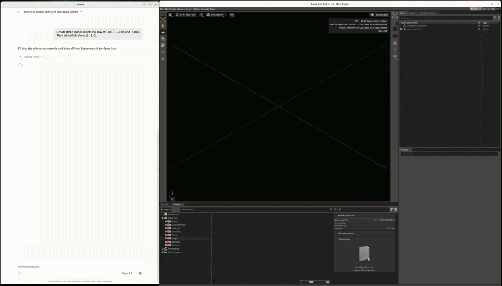

# 04 — Three Frankas in a row + a Go1

## Task ID & goal
**Task ID:** `04_three_frankas_one_go1`
**One-line goal:** Spawn three Franka arms in a row along X and add a Unitree Go1 quadruped offset along Y.

## Verbatim prompt sent to Claude
> Create three Franka robots in a row at [0,0,0], [2,0,0], and [4,0,0].
> Then add a Go1 robot at [1, 3, 0].

## Initial scene state
- **USD file:** in-memory stage carried over from task 03.
- **Objects present at task start:**
  - `/World/PhysicsScene` + ground plane
  - `/World/Lights/DomeLight` (intensity 3000, neutral)
  - `/World/Lights/KeyLight` (DistantLight, intensity 5000, slightly warm)
  - `/World/WorkspaceCamera` at `[2, -2, 1.5]` aimed at the origin
- **Simulation state:** stopped.

## Success criteria
1. Three Franka articulations spawned at `/World/Franka_1`, `/World/Franka_2`, `/World/Franka_3` at the requested XYZ.
2. One Unitree Go1 quadruped at `/World/Go1` at `[1, 3, 0]`.
3. Each robot reports the expected DOF count (Franka FR3: 9 DOF; Go1: 12 DOF).
4. No tool-call errors.
5. Any drive-tuning issues that would prevent the scene from running are flagged to the user *before* the user presses play.

## Cross-references
- **Transcript:** `../orchestration_logs/04_three_frankas_one_go1.md`
- **Tool-call trace:** `../orchestration_logs/04_three_frankas_one_go1.jsonl`
- **Generated scripts:** *(none — all work was direct MCP tool calls)*
- **Scoring:** `../evaluation_notes/04_three_frankas_one_go1.md`

## Video 

